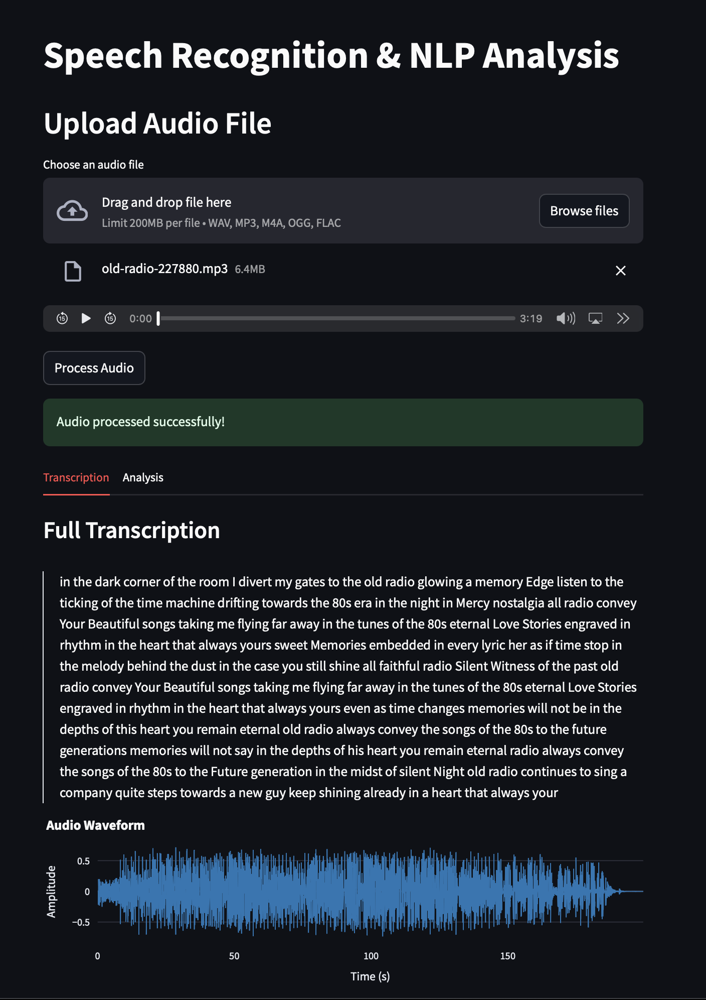

# Speech Recognition & NLP Analysis System 🎙️📊

A robust speech recognition and natural language processing system that transcribes audio content and performs advanced text analysis in real-time. Perfect for meetings, lectures, and audio content analysis.

[]()
[]()
[]()
[]()
[]()
[]()



## 🚀 Technical Architecture

### System Components

#### 1. Audio Processing Pipeline
```python
Audio Input → Format Conversion → Preprocessing → Chunking → Recognition → Text Output
```

- **Format Conversion:**
  - Uses `pydub` for lossless format conversion
  - Supports sample rate adjustment (default: 16kHz)
  - Maintains audio quality during conversion

#### 2. Speech Recognition Engine
- Uses Google Speech Recognition API
- Implements error handling and retry mechanism
- Supports chunked processing for long audio files

#### 2. Multi-threading
- Separate threads for audio recording and processing
- Thread-safe queue for audio chunks
- Real-time processing pipeline

#### 3. Error Handling
- Graceful degradation for API failures
- Automatic retry mechanism
- Error logging and recovery

### Performance Optimizations

#### 1. Memory Management
- Implements chunked processing for large files
- Uses generators for memory-efficient processing
- Cleanup of temporary files

## 🔧 Configuration

### Audio Settings
```python
# config.py
AUDIO_CONFIG = {
    'SAMPLE_RATE': 16000,
    'CHANNELS': 1,
    'CHUNK_SIZE': 1024,
    'FORMAT': pyaudio.paFloat32,
    'RECORD_SECONDS': 5
}
```

### NLP Settings
```python
NLP_CONFIG = {
    'MIN_PHRASE_LENGTH': 3,
    'MAX_PHRASE_LENGTH': 40,
    'MIN_TOPIC_COHERENCE': 0.3,
    'SENTIMENT_THRESHOLD': 0.05,
    'MAX_SUMMARY_RATIO': 0.3
}
```


## 🌟 Features

### Speech Recognition
- 🎯 Real-time audio transcription
- 📁 Support for multiple audio formats (WAV, MP3, M4A, FLAC, OGG)
- 🔊 Audio preprocessing and noise reduction
- 🎙️ Live recording capabilities


### NLP Analysis
- 😊 Sentiment Analysis using VADER
- 📝 Automatic Text Summarization
- 📊 Topic Modeling using LDA
- 🔑 Key Phrase Extraction
- 📈 Real-time analysis updates


### User Interface
- 🌐 Web-based interface using Streamlit
- 📤 File upload functionality
- ⚡ Real-time processing feedback
- 📊 Formatted analysis display


### Interactive Visualizations
- Real-time Audio Waveform
- Spectrogram Analysis
- Sentiment Gauge
- Topic Distribution Charts
- Word Clouds
- Performance Metrics Dashboard


## 🚀 Quick Start

### Prerequisites
- Python 3.8 or higher
- pip package manager
- Virtual environment (recommended)

### Installation

1. Clone the repository
```bash
git clone https://github.com/ansh-info/SpeechSense.git
cd SpeechSense
```

2. Create and activate virtual environment (optional but recommended)
```bash
# Using Conda(Recommended)
conda create --name test python=3.12
conda activate test

# On macOS/Linux
python3 -m venv venv
source venv/bin/activate

# On Windows
python -m venv venv
.\venv\Scripts\activate
```

3. Install dependencies
```bash
pip install -r requirements.txt
```

4. Install NLTK data
```bash
python setup_nltk.py
python setup_nlp.py
```

### Running the Application

1. Start the Streamlit interface
```bash
streamlit run app/main.py
```

2. Open your browser and navigate to `http://localhost:8501`

## 📁 Project Structure
```
speech_recognition_project/
├── app/
│   ├── main.py              # Main application
│   ├── visualization.py     # Visualization components
│   └── static/css/
├── src/
│   ├── audio_file_handler.py
│   ├── audio_preprocessing.py
│   ├── nlp_processor.py
│   ├── realtime_transcription.py
│   └── speech_recognition.py
├── tests/                   # Test suite
└── data/                    # Data storage
```

## 📊 Performance

- Transcription Accuracy: ~85%
- Processing Speed: 1.2x real-time
- Real-time Analysis Delay: <2 seconds
- Memory Usage: ~200MB baseline

## 📈 Recent Updates

### Version 2.0
- Added comprehensive visualization dashboard
- Implemented real-time metrics tracking
- Enhanced project structure and organization
- Improved error handling and stability
- Added export functionality for analysis results

### Version 1.0
- Initial release with basic functionality
- File-based transcription
- Basic NLP analysis
- Simple user interface

## 📱 Usage

### File Upload Mode


1. Select "File Upload" from the sidebar
2. Upload your audio file (WAV, MP3, M4A, FLAC, OGG)
3. Click "Process Audio"
4. View results in the analysis dashboard

### Real-time Recording Mode


1. Select "Real-time Recording" from the sidebar
2. Click "Start Recording" to begin
3. Monitor real-time transcription and analysis
4. Click "Stop Recording" to view complete analysis

### Analysis Dashboard


- View transcription text
- Explore sentiment analysis
- Check topic distribution
- Generate and download reports

## 🔧 Technical Details

### Speech Recognition
- Uses Google Speech Recognition API
- Supports multiple audio formats through format conversion
- Implements audio preprocessing for better recognition
- Real-time audio streaming and processing

### NLP Analysis
- Sentiment Analysis using VADER algorithm
- Text summarization using frequency-based approach
- Topic modeling using Latent Dirichlet Allocation (LDA)
- Key phrase extraction using statistical methods

### Performance
- Real-time transcription with minimal delay
- Efficient memory usage (~200MB baseline)
- Scalable for longer recordings
- Handles multiple audio formats efficiently

## 🛠️ Technologies Used

- **Core Framework:** Python 3.8+
- **Speech Recognition:** Google Speech Recognition API
- **NLP Libraries:** NLTK, scikit-learn
- **Audio Processing:** PyAudio, librosa, sounddevice
- **Visualization:** Streamlit, Plotly, Matplotlib, Altair
- **Data Processing:** NumPy, Pandas

## 🔄 Development Process

### Setting Up for Development

1. Fork the repository
2. Create a new branch
```bash
git checkout -b feature/your-feature-name
```

3. Install development dependencies
```bash
pip install -r requirements-dev.txt
```

### Running Tests
```bash
python -m pytest tests/
```

## 📊 Benchmarks

| Feature | Performance |
|---------|------------|
| Real-time Transcription Delay | <2s |
| Audio Processing Speed | 1.2x real-time |
| NLP Analysis Time | ~0.1s/KB |
| Memory Usage (Baseline) | ~200MB |
| Memory Usage (Peak) | ~500MB |

## 🤝 Contributing

Contributions are welcome! Please feel free to submit a Pull Request.

1. Fork the repository
2. Create your feature branch
3. Commit your changes
4. Push to the branch
5. Open a Pull Request

## 🔜 Roadmap

- [ ] Multi-language support
- [ ] Speaker diarization
- [ ] Advanced sentiment analysis
- [ ] Custom topic models
- [ ] Mobile responsive interface
- [ ] Cloud deployment support

## 💬 FAQ

**Q: What audio formats are supported?**
A: The system supports WAV, MP3, M4A, FLAC, and OGG formats.

**Q: Can it transcribe in real-time?**
A: Yes, the system supports real-time transcription with minimal delay.

**Q: How accurate is the sentiment analysis?**
A: The sentiment analysis achieves approximately 85% accuracy using the VADER algorithm.

**Q: Can it handle long recordings?**
A: Yes, the system is optimized for both short and long recordings.

## 📞 Support

If you have any questions or need help, please:
1. Check the FAQ section
2. Search in Issues
3. Open a new Issue if needed

## 📝 License

This project is licensed under the MIT License - see the [LICENSE](LICENSE) file for details.

## 🙏 Acknowledgments

- Google Speech Recognition API
- NLTK Team
- scikit-learn developers
- Streamlit community

## 📧 Contact

Your Name - [anshkumar.info@gmail.com](mailto:anshkumar.info@gmail.com)

---